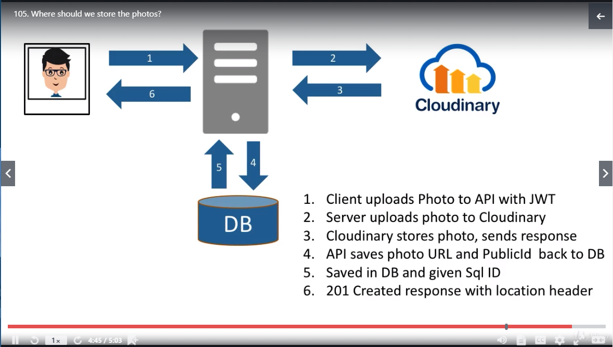

# General Backend
## Photo Storage Options
* What storage should we use for photos? 
    * In DB as BLOBs? 
        * +Easy to program and it can be authenticated easily.
        * -Is inefficient to access and with it's storage. Takes up space directly on the server. Hard to scale.
    * In a File System? 
        * +Efficient with space and made to handle files.
        * -Can be expensive and takes up space on the server. Hard to scale. Storage can be expensive.
    * __In a Cloud Service?__
        * +This allows us to scale and use the storage type solutions.
        * -This will have added complexity with our code to be able to ensure authentication, storing references instead of data directly.

For this, we will be using Cloud Storage and using __Cloudinary__ due to it's great free tier. It also supports API Keys and API Secrets.

### Flow Diagram

# ASP.NET Core

# Angular

# Chrome Debugging
