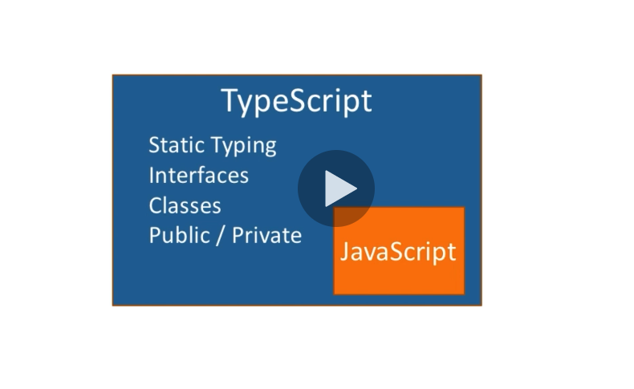

# ASP.NET Core

# Angular
## What is TypeScript
TypeScript is a superset of JavaScript. We will write all of our code in TypeScript, but it will get converted into JavaScript so that all browsers can display it properly. 

[Overview](https://www.udemy.com/course/build-an-app-with-aspnet-core-and-angular-from-scratch/learn/lecture/8708428#announcements)

* This conversion process from TypeScript -> JavaScript is called `transpiled`.

* `Route Resolvers` can be used to load the data for a component before it is requested. This can alleviate the need for null-checking ("safe navigation operators") '?' in .html references to the component data.

# Chrome Debugging
